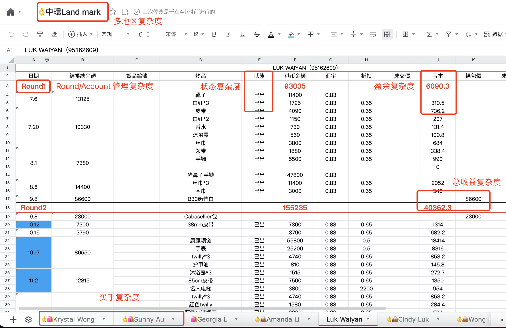
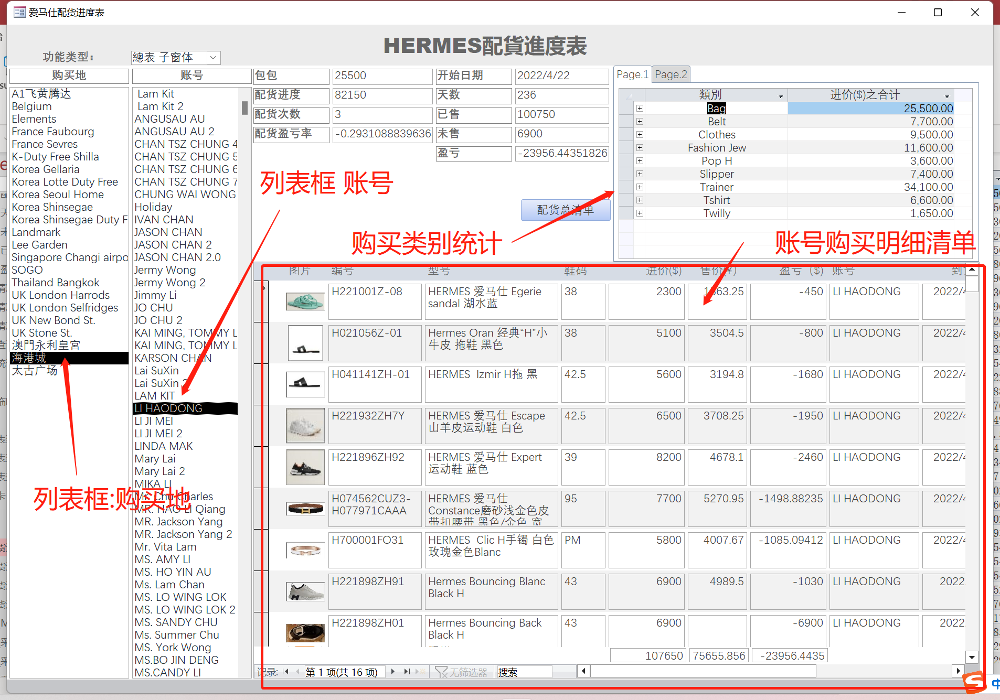
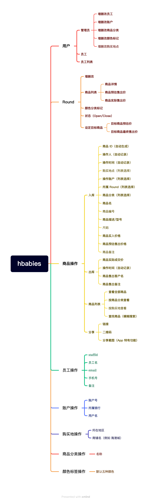

# Hbabies 需求文档

## Background

拆分复杂度现状：
- 目前团队使用[腾讯文档](https://docs.qq.com)来管理订单。
- **人员、账户管理难度。** 有接近 20 人左右的买手共同入单/出单，每个人也可能用不同的账户操作货品。
- **Round 管理复杂度。** 会根据不同的 Target 形成每一个 Round，比如 Target 一个 Hermes Birkin 包，Round 内需要配 X 的各类商品，维护全靠人工编辑十分麻烦，也容易出错。
- **状态复杂度。** 每一个商品入货，出货需要找到对应的账户、买手确认，同时还要手动标记，很容易出错，类同的商品（例如丝巾）更加是难以匹配账号。
- **盈余复杂度。** 每个商品有一个预期出货价和最终出货价，Target 也有个估算价，还要同时算买入价，很容易错乱，也比较难以管理。
- **地区复杂度。** 有可能有不同地区的买手，共同维护表会产生以上更复杂的管理以及沟通问题。

除此之外，真正的痛点还有如下：
- **入单麻烦。** 通过人工维护文档，容易出错，容易填漏，也很容易搞错品类，名字，后面难以维护。
- **商品标签和唯一性。** 商品没有统一的标签维护，例如如何快速搜到全部丝巾有哪些，现在是十分困难的；同时，丝巾可能有几条差不多的，很难归类到时哪个账户/买手购买的，需要人工标注或者记住，没办法生成一个唯一 ID。
- **出单麻烦。** 同理，拿丝巾举例，出单需要先确认是哪个买手、哪个账号、哪条围巾，这个过程就十分麻烦了。

## Production

因此，我们决定做这个产品，该产品包括以下几个规划：
- _Hbabies Website [https://hbabies.shop](https://hbabies.shop)_ 可以在网站上实现全部产品功能。
- _Hbabies iOS App_ 可以通过手机 App 进行更优秀的交互功能。
- _底层 Support_ 例如服务器、数据库、域名、后台管理系统等。

同时，有一个 access 做的建议系统用于借鉴：

## Feature

产品功能

### 登录（不做注册）

- 员工登录
- 管理员登录

### 管理员特权

- 增删员工信息
- 增删账户信息
- 增删购买地信息
- 增删商品标签信息

### 通用能力

- 商品功能
- Round 功能
- 员工功能
- 标签功能
- 账户管理功能
- 购买地管理功能

### 商品功能

- 商品列表
- 商品查找
- 商品详情
- 商品入库
- 商品出库
- 商品唯一码索引（ID、链接、二维码）
- 商品分享
- 商品归类
- 商品状态（付订金、在途、入库、出库）

### Round 功能

- 新增 Round
- 管理 Round 内商品
- 标记 Round 标签（五个颜色标签标记优先级）
- 修改 Round 状态（开放、结束）
- 自动计算 Round 内商品和 Target 盈余

### 员工功能

- 员工列表
- 员工详情
- 员工状态
- 员工操作商品记录

### 标签功能

- 商品标签
- Round 颜色标签（五档）

### 账号（信用卡）管理功能

- 新增账户
- 修改账户信息
- 删除账户
- 设置账户余额
- 根据时间范围和订单扣价查询账户余额

### 购买地功能

- 新增购买地
- 修改购买地信息
- 删除购买地

## 整体架构

注意：
- 商品不能脱离 Round 存在，一定有 round 才有商品
- 员工、标签需要管理员预定义才能使用

## 数据库表结构文档

DatabaseStruct.md

[DatabaseStruct.md](DatabaseStruct.md)